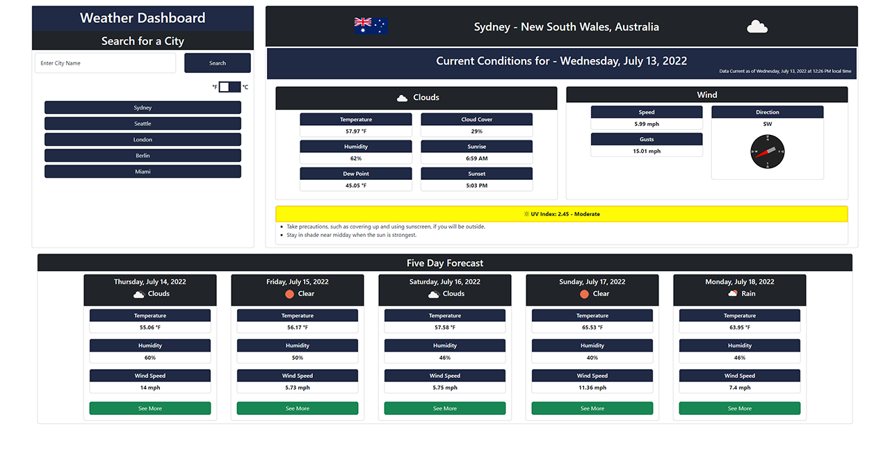

# Weather Dashboard
## Deployed Application
[Deployed Application](https://danielstewart914.github.io/weather-dashboard/)
## Description

### A Simple Weather Dashboard for checking the weather in multiple different cities. 

## Table of Contents

- [Usage](#usage)
- [License](#license)
- [Technology](#technology)
- [Questions](#questions)

## Usage

- Type a city name into the search field and click search.
- The current weather will be displayed for that city along with a 5 day forecast.
- Click on the 'See More' button at the bottom of any of the 5 day forecast cards to bring up the full weather info for that day.
- If you prefer metric measurements click the toggle labeled with &#8457; and &#8451;. 
- Click the the toggle again to switch back to imperial measurements.
- You can also find the weather for a city you have previously search for by clicking on the corresponding button in the search history column.

### Preview image

## License

MIT License

Copyright 2022 &copy; Daniel Stewart

Permission is hereby granted, free of charge, to any person obtaining a copy of this software and associated documentation files (the "Software"), to deal in the Software without restriction, including without limitation the rights to use, copy, modify, merge, publish, distribute, sublicense, and/or sell copies of the Software, and to permit persons to whom the Software is furnished to do so, subject to the following conditions:

The above copyright notice and this permission notice shall be included in all copies or substantial portions of the Software.

THE SOFTWARE IS PROVIDED "AS IS", WITHOUT WARRANTY OF ANY KIND, EXPRESS OR IMPLIED, INCLUDING BUT NOT LIMITED TO THE WARRANTIES OF MERCHANTABILITY, FITNESS FOR A PARTICULAR PURPOSE AND NONINFRINGEMENT. IN NO EVENT SHALL THE AUTHORS OR COPYRIGHT HOLDERS BE LIABLE FOR ANY CLAIM, DAMAGES OR OTHER LIABILITY, WHETHER IN AN ACTION OF CONTRACT, TORT OR OTHERWISE, ARISING FROM, OUT OF OR IN CONNECTION WITH THE SOFTWARE OR THE USE OR OTHER DEALINGS IN THE SOFTWARE.

## Technology

### Languages

- 
- 
- 

### Libraries

- 
- 
- 

### APIs

- 
- 

## Questions 

Contact me through one of the links below  
[GitHub](https://github.com/danielstewart914) 
[Email](mailto:danielstewart914@outlook.com)